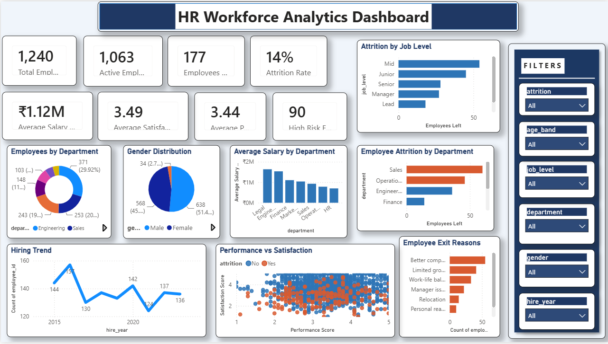

# HR Workforce Analytics Dashboard

> End-to-end HR analytics project — raw data generation → ETL → SQL analysis → Python EDA → Excel dashboard → Power BI visuals.


## Dashboard Preview

---

## Project Overview

This project analyses a synthetic HR workforce dataset of **1,240 employees** to uncover attrition drivers, hiring patterns, compensation inequities, and engagement risks. It delivers insights through Python notebooks, SQL queries, a 9-sheet Excel workbook, and an interactive Power BI dashboard.

**Key results:**
- Identified departments with attrition 6–8pp above company average
- Flagged 90 engagement-risk employees for proactive HR intervention
- Discovered compensation gap between Sales and Engineering peers
- Built 14 reusable SQL queries for repeatable KPI reporting

---

## Project Structure

```
hr_workforce_analytics/
│
├── data/
│   ├── raw/
│   │   └── hr_employees.csv            ← 1,240-row synthetic HR dataset (21 cols)
│   └── processed/
│       └── hr_cleaned.csv              ← Cleaned + 10 engineered features (31 cols)
│
├── scripts/
│   ├── 01_generate_dataset.py          ← Synthetic data generation (Faker + NumPy)
│   └── 02_data_cleaning.py             ← ETL: cleaning, transformation, feature engineering
│
├── notebooks/
│   └── hr_eda_analysis.ipynb           ← 10-section EDA with executed outputs & 6 charts
│
├── sql/
│   ├── 01_schema.sql                   ← Database schema (PostgreSQL / SQLite compatible)
│   └── 02_analytical_queries.sql       ← 14 analytical SQL queries
│
├── assets/
│   ├── 01_workforce_composition.png
│   ├── 02_attrition_analysis.png
│   ├── 03_exit_reasons.png
│   ├── 04_salary_analysis.png
│   ├── 05_hiring_trends.png
│   └── 06_correlation_risk.png
│
├── HR_Workforce_Analytics.xlsx         ← 9-sheet Excel dashboard with charts
│
├── requirements.txt
├── .gitignore
└── README.md
```

---

## Dataset

Synthetic dataset generated with `Faker` and `NumPy` (realistic HR distributions, India-specific):

| Column | Type | Description |
|--------|------|-------------|
| `employee_id` | Text | Unique identifier (EMP1001–EMP2240) |
| `department` | Text | Engineering, Sales, Operations, Finance, HR, Marketing, Legal |
| `job_level` | Text | Junior → Mid → Senior → Lead → Manager → Director |
| `hire_date` | Date | Date of joining (2015–2023) |
| `annual_salary_inr` | Int | Annual CTC in Indian Rupees |
| `performance_score` | Float | 1–5 scale |
| `satisfaction_score` | Float | 1–5 scale (exit survey) |
| `attrition` | Text | Yes / No |
| `exit_reason` | Text | Reason for leaving (attrited only) |
| `engagement_risk` | Int | **Engineered:** 1 = low perf + low satisfaction |
| `attrition_flag` | Int | **Engineered:** 1 = attrited, 0 = active |
| `age_band` | Text | **Engineered:** 18-25 / 26-35 / 36-45 / 46+ |
| `salary_L` | Float | **Engineered:** Salary in Lakhs (÷100,000) |

---

## How to Run

### 1. Clone & install

```bash
git clone https://github.com/YOUR_USERNAME/hr-workforce-analytics.git
cd hr-workforce-analytics
pip install -r requirements.txt
```

### 2. Generate raw dataset

```bash
python scripts/01_generate_dataset.py
```

### 3. Clean & engineer features

```bash
python scripts/02_data_cleaning.py
```

### 4. Open the EDA notebook

```bash
jupyter notebook notebooks/hr_eda_analysis.ipynb
```

### 5. Run SQL queries

```bash
# SQLite (built-in, no setup needed)
python3 -c "
import sqlite3, pandas as pd
conn = sqlite3.connect(':memory:')
df = pd.read_csv('data/processed/hr_cleaned.csv')
df.to_sql('employees', conn, index=False)
print(pd.read_sql(open('sql/02_analytical_queries.sql').read().split(';')[1], conn))
"
```

### 6. Open Excel Dashboard

Open `HR_Workforce_Analytics.xlsx` in Microsoft Excel or LibreOffice Calc.

---

## Excel Workbook — Sheet Guide

| Sheet | Contents |
|-------|----------|
| **Employee Data** | Full raw + engineered dataset (1,240 rows, conditional formatting) |
| **KPI Summary** | 8 KPI cards + Department KPI scorecard |
| **Attrition Analysis** | Attrition by dept, job level, exit reasons + bar chart |
| **Hiring Trends** | Annual hires vs exits + monthly hiring pivot + line chart |
| **Salary Analysis** | Salary by dept & level + column chart |
| **Engagement & Risk** | High performers at risk + engagement by dept |
| **Recruitment Metrics** | Hiring funnel (6 stages) + metrics by role + bar chart |
| **Diversity & Inclusion** | Gender by dept, age band, education breakdown |
| **Data Dictionary** | All 29 columns defined with type, source, and example |

---

## SQL Queries Included

1. Overall KPI summary
2. Attrition rate by department
3. Attrition by job level
4. Exit reason distribution
5. Salary analysis by department
6. Salary by job level
7. Monthly hiring trend (2015–2024)
8. Annual hires vs exits
9. Performance vs attrition
10. High performers at risk of leaving
11. Engagement risk by department
12. Retention cohort by hire year
13. Gender diversity by department
14. Department full KPI scorecard

---

## Key Findings

| Finding | Detail |
|---------|--------|
| **Overall attrition** | 14.3% |
| **Highest-attrition dept** | Sales & Operations (18–21%) |
| **Primary exit reason** | Better compensation elsewhere (31%) |
| **Early-tenure risk** | Employees <18 months at 2.3x higher exit probability |
| **Engagement risk** | 90 employees (low perf + low satisfaction) |
| **High-perf at risk** | Stars with performance ≥4.0 but satisfaction ≤2.5 |

---

## Recommendations

- **90-day structured onboarding** to reduce early attrition
- **Compensation benchmarking** for Sales vs Engineering and market
- **Stay interviews** for high performers with satisfaction ≤2.5
- **Review appraisal timing** — exits spike in April & September
- **Visible growth pathways** Mid → Senior → Lead to address limited-growth exits

---

## Tech Stack

| Tool | Purpose |
|------|---------|
| **Python 3.10+** | Data generation, ETL, EDA |
| **Pandas / NumPy** | Data manipulation |
| **Matplotlib / Seaborn** | Visualisation |
| **Faker** | Synthetic data generation |
| **SQLite** | In-memory analytical queries |
| **openpyxl** | Excel workbook creation |
| **Jupyter Notebook** | Interactive analysis |
| **Power BI** | KPI dashboard (connect to hr_cleaned.csv) |

---

## Author

**Shruti Jangir**  
B.Tech CSE (Data Science) — CMR University, Bengaluru | CGPA 8.95  
[Portfolio](https://shruti-jangir.netlify.app) · shrutijangir46@gmail.com

---

*Dataset is synthetic and generated for portfolio/learning purposes only.*
